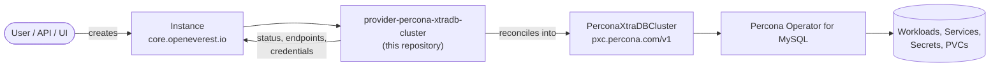

# Percona XtraDB Cluster Provider

> [!WARNING]
> **Pre-alpha.** OpenEverest v2 and this provider are under active development. CRD schemas,
> chart values and defaults change frequently, including in breaking ways, and there is no
> supported upgrade path between versions yet. Not for production use.

<!-- Remove the pre-alpha banner and the status badge at v2 GA. -->

[](https://github.com/openeverest/openeverest)
[](https://github.com/openeverest/provider-percona-xtradb-cluster/actions/workflows/ci.yaml)
[](https://pkg.go.dev/github.com/openeverest/provider-percona-xtradb-cluster)
[](LICENSE)

Run **MySQL, clustered with Percona XtraDB Cluster**, on Kubernetes through
[OpenEverest](https://github.com/openeverest/openeverest), backed by the
[Percona Operator for MySQL](https://github.com/percona/percona-xtradb-cluster-operator).

## What this is

OpenEverest providers translate a single, technology-agnostic `Instance` custom resource into
the native custom resources of an upstream Kubernetes operator — for databases, but equally
for caches, message queues, object storage, or model-serving runtimes. This repository is the
provider for **Percona XtraDB Cluster**: it owns the technology-specific knowledge —
topologies, versions, parameters, backup wiring — so that users, the API server, and the UI
stay technology-agnostic.

> [!IMPORTANT]
> **This provider is not standalone.** It requires an OpenEverest installation (core CRDs and
> controller) in the cluster. Installing this chart on its own does nothing.
> See [Install OpenEverest](https://openeverest.io/documentation/current/quick-install.html).



The provider watches `Instance` resources whose `spec.providerRef.name` is
`percona-xtradb-cluster`, and reports workload health back onto `Instance.status`. It never
manages pods directly — all lifecycle work is delegated to the operator.

## Compatibility

This provider has **not been released yet** — the table describes `main`.

| provider-percona-xtradb-cluster | OpenEverest | Percona Operator for MySQL | Kubernetes |
|---|---|---|---|
| `main` | `>= 2.0.0` | `1.20.x` | `1.30` – `1.34` |

## Capabilities

| Capability | Status | Notes |
|---|---|---|
| Provisioning | ✅ | |
| Horizontal scaling | ✅ | `spec.components.<name>.replicas` |
| Vertical scaling (CPU / memory) | ✅ | `spec.components.<name>.resources` |
| Version upgrades | ✅ | change `spec.version`; see [Versions](#versions) |
| Custom configuration | ✅ | `my.cnf` via the engine component's `configuration` parameter |
| Monitoring | ✅ | PMM, via the optional `monitoring` component |
| TLS | ⚠️ | the operator provisions certificates, but the connection string reported on the Instance requests `tls=false` |

Stateful workloads additionally report:

| Capability | Status | Notes |
|---|---|---|
| Persistent storage | ✅ | `spec.components.engine.storage` |
| Storage expansion | ✅ | when the StorageClass allows volume expansion |
| Backups (on demand) | ✅ | operator-native (`executionMode: ProviderManaged`) via Percona XtraBackup |
| Backups (scheduled) | ✅ | per-storage schedules on `spec.backup.storages[].schedules[]` |
| Point-in-time recovery | ✅ | one storage may enable PITR |
| Restore | ✅ | in place, and into a new Instance via `spec.dataSource` |

## Installation

> [!NOTE]
> There is no published chart yet. Until the first release, install from a checkout.

```bash
git clone https://github.com/openeverest/provider-percona-xtradb-cluster.git
cd provider-percona-xtradb-cluster
helm dependency build charts/provider-percona-xtradb-cluster
helm install provider-percona-xtradb-cluster charts/provider-percona-xtradb-cluster \
  --namespace everest-system
```

`make helm-install` does the same thing against your current kube context.

- The Percona Operator for MySQL is bundled as a chart dependency and is installed
  automatically.

Uninstall:

```bash
helm uninstall provider-percona-xtradb-cluster --namespace everest-system
```

Uninstalling the chart does **not** delete running `Instance` resources or their data.

## Usage

Verify that the provider registered itself:

```bash
kubectl get providers.core.openeverest.io percona-xtradb-cluster
```

Create an instance:

```yaml
apiVersion: core.openeverest.io/v1alpha1
kind: Instance
metadata:
  name: my-instance
spec:
  providerRef:
    name: percona-xtradb-cluster
  components:
    engine:
      type: pxc
      replicas: 3
      resources:
        requests:
          cpu: 500m
          memory: 2G
      storage:
        size: 10Gi
```

Component names are defined by this provider — see [definition/provider.yaml](definition/provider.yaml).
`spec.version` and `spec.topology` are optional; the provider defaults apply.
More examples live in [examples/](examples/).

Watch it come up and read the connection details:

```bash
kubectl get instance my-instance -w
kubectl get instance my-instance -o jsonpath='{.status.connection}'
```

Credentials are in the secret named by `.status.connection.credentialsSecretRef`.

## Topologies

<!-- BEGIN GENERATED: topologies -->
| Topology | Default | Description |
|---|---|---|
| `cluster` | ✅ | Galera cluster: 3 `engine` members by default, fronted by 2 `proxy` replicas |
<!-- END GENERATED: topologies -->

The `proxy` component defaults to HAProxy; ProxySQL images are also catalogued. The
`monitoring` component is optional.

## Versions

<!-- BEGIN GENERATED: versions -->
| Version bundle | Default | pxc | backup (XtraBackup) | pmm |
|---|---|---|---|---|
| `8.4.8` | ✅ | `8.4.8-8.1` | `8.4.0-5.1` | `3.8.0` |
| `8.4.7` | | `8.4.7-7.1` | `8.4.0-5.1` | `3.8.0` |
| `8.4.5` | | `8.4.5-5.1` | `8.4.0-5.1` | `3.8.0` |
| `8.0.45` | | `8.0.45-36.1` | `8.0.35-35.1` | `3.8.0` |
| `8.0.44` | | `8.0.44-35.1` | `8.0.35-35.1` | `3.8.0` |
| `8.0.42` | | `8.0.42-33.1` | `8.0.35-35.1` | `3.8.0` |
| `8.0.41` | | `8.0.41-32.1` | `8.0.35-35.1` | `3.8.0` |
| `8.0.39` | | `8.0.39-30.1` | `8.0.35-35.1` | `3.8.0` |
| `5.7.44` | | `5.7.44-31.65` | `2.4.29` | `3.8.0` |
| `5.7.42` | | `5.7.42-31.65` | `2.4.29` | `3.8.0` |
| `5.7.39` | | `5.7.39-31.61` | `2.4.29` | `3.8.0` |
| `5.7.36` | | `5.7.36-31.55` | `2.4.29` | `3.8.0` |
| `5.7.34` | | `5.7.34-31.51` | `2.4.29` | `3.8.0` |
<!-- END GENERATED: versions -->

Source of truth: [definition/versions.yaml](definition/versions.yaml).

MySQL only supports upgrading one major version at a time (5.7 → 8.0 → 8.4), and the operator
must already support the target version — upgrade the provider chart first.

## Configuration

- **Chart values:** [charts/provider-percona-xtradb-cluster/values.yaml](charts/provider-percona-xtradb-cluster/values.yaml)
- **Instance parameters:** per-component and per-topology `parameters` schemas, defined under
  [definition/](definition/) and published on the `Provider` resource
  (`kubectl get provider percona-xtradb-cluster -o yaml`). The API server and the UI validate
  user input against these schemas.

The technology-specific knobs worth knowing about:

| Parameter | Applies to | Purpose |
|---|---|---|
| `configuration` | `engine` | Raw `my.cnf` configuration passed to the operator |
| `monitoringConfigName` | `monitoring` | PMM configuration to attach the instance to |

## Development

Requires Go (see [go.mod](go.mod)), Docker, Helm, kubectl, and a Kubernetes cluster you can
reach. [dev/README.md](dev/README.md) covers the environment end to end: the recommended
local k3d setup, running against a cluster you already have, and every `dev/.env` setting.

```bash
make dev-up             # local cluster + Tilt dev environment (see dev/README.md)
make generate           # RBAC, provider spec, Helm chart sync
make run                # run the provider locally against the cluster
make test-unit
make test-integration   # chainsaw suites under test/integration/
make dev-down
```

`make help` lists every target. `make verify` fails when generated files are stale — run
`make generate` and commit the result.

The provider contract (`Validate` / `Sync` / `Status` / `Cleanup`), RBAC markers, watches,
code generation, and the backup/restore interfaces are documented once for all providers in
[PROVIDER_DEVELOPMENT.md](https://github.com/openeverest/provider-sdk/blob/main/PROVIDER_DEVELOPMENT.md).

### Layout

| Path | Purpose |
|---|---|
| `cmd/provider/` | Entry point |
| `internal/provider/` | `ProviderInterface` implementation, backup interfaces, RBAC markers |
| `internal/common/` | Component name constants |
| `definition/` | Provider identity, component types, versions, topologies, backup classes |
| `charts/provider-percona-xtradb-cluster/` | Helm chart (`generated/` is produced by `make generate`) |
| `config/rbac/role.yaml` | Generated `ClusterRole` — do not edit |
| `examples/` | Example `Instance` resources |
| `dev/` | Tilt dev environment, `.env` configuration, k3d cluster config |
| `.github/workflows/` | CI: lint, build, unit and integration tests, release |

### Testing

- **Unit tests** — `make test-unit`.
- **Integration tests** — `make test-integration` runs the chainsaw suites; individual suites
  are also exposed as make targets (`make test-integration-core`,
  `make test-integration-backup`, `make test-integration-monitoring-pmm`, …).
- **CI** — [.github/workflows/ci.yaml](.github/workflows/ci.yaml) runs lint, build, unit
  tests, generated-file verification, Helm lint, and each integration suite on every pull
  request.

## Troubleshooting

```bash
kubectl logs -n everest-system deploy/provider-percona-xtradb-cluster -f
```

| Symptom | Where to look |
|---|---|
| `Instance` stuck in `Creating` | `kubectl describe instance <name>` conditions, then the provider logs |
| No `Provider` resource in the cluster | Is the chart installed? Check the provider deployment logs |
| `Instance` ignored entirely | `spec.providerRef.name` must be `percona-xtradb-cluster` |
| `PerconaXtraDBCluster` created but no pods | Inspect the `PerconaXtraDBCluster` status — the failure is upstream in the operator |
| Backups never complete | Check the `Backup` resource status and the XtraBackup pod logs |

Galera requires an odd number of members; single-node clusters are development-only.

## Contributing

Issues and pull requests are welcome. See
[PROVIDER_DEVELOPMENT.md](https://github.com/openeverest/provider-sdk/blob/main/PROVIDER_DEVELOPMENT.md)
and the [OpenEverest Code of Conduct](https://github.com/openeverest/openeverest/blob/main/CODE_OF_CONDUCT.md).

## Security

Report vulnerabilities per the
[OpenEverest security policy](https://github.com/openeverest/openeverest/blob/main/SECURITY.md).
Please do not open public issues for security reports.

## License

Apache License 2.0 — see [LICENSE](LICENSE) for details.
